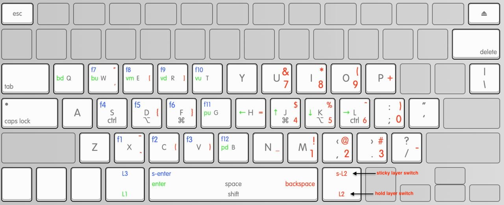

# Personal MacOS configs & dotfiles

## Aerospace | [./aerospace](./aerospace) | [link 2 project](https://github.com/nikitabobko/AeroSpace)

Mostly default config

- Added stuff to work with Sketchybar

## JankyBorders | [./borders](./borders) | [link 2 project](https://github.com/FelixKratz/JankyBorders)

run `brew services start borders` after installing

## Ghostty | [./ghostty](./ghostty) | [link 2 project](https://github.com/ghostty-org/ghostty)

- Transparent background
- ctrl+p for doom drop down terminal

## Kanata | [./kanata](./kanata) | [link 2 project](https://github.com/jtroo/kanata)

Inspired by [this](https://github.com/dreamsofcode-io/home-row-mods)\
with recommendations from [this](https://github.com/jtroo/kanata/discussions/1455#discussion-7766783)\
& [this](https://www.youtube.com/watch?v=8wZ8FRwOzhU) must watch

made to be a single sensible config for both a split keyboard like the corne and a normal keyboard/

- makes better use of the largest key on a standard keyboard (the space key)
- quick access to common vim keys with sticky left meta key layer:
  - j -> $
  - k -> %
  - l -> ^
- intuitive paragraph scrolling in vim:
  - (right meta + d/f) mirrors the j/k up down
- chords for common utility keys
  - (w e) key chord -> esc
  - (o p) key chord -> delete word (option+backspace)
  - (j k) key chord -> enter/return
- [Home row mods](https://precondition.github.io/home-row-mods#what-are-home-row-mods)
- tapping right meta twice switches to a 'normal' layer, for gaming, or when other people need to use the keyboard
  - from the 'normal' layer: tapping right meta followed by left meta goes back to the main layer

*image is slightly outdated. i'll fix it eventually*

## Kanata observer | [./kanata_observer](./kanata_observer) | [link 2 project](https://github.com/Kainoa-h/kanata-layer-observer)

configs for a service that listens for kanata layer changes and runs a script to update sketchybar

## ncspot | [./ncspot](./ncspot) | [link 2 project](https://github.com/hrkfdn/ncspot)

- sane play/pause icon config

## ncspot | [./ncspot-controller](./ncspot-controller) | [link 2 project](https://github.com/Kainoa-h/ncspot-controller)

configs for a service that wraps the ncspot unix socket to integrate with sketchybar

## Neovide | [./neovide](./neovide) | [link 2 project](https://github.com/neovide/neovide)

- `fork=true` so it doesn't block the shell after launch

## neovim | [./nvim](./nvim) | [link 2 project](https://github.com/folke/lazy.nvim)

- using [lazy](https://www.lazyvim.org/)

## Obsidian | [./obsidian](./obsidian) | [link 2 project](https://obsidian.md/)

*Configuration not really related to obsidian the app itself, but rather to it's plugins*

- central [vimrc config](./obsidian/.obsidian.vimrc) for all vaults to symlink to
- [shell script](./obsidian/dayplanner.sh) for [day planner plugin](https://github.com/Kainoa-h/obsidian-day-planner-event-exec/tree/main) to execute

## rustfmt | [./rustfmt](./rustfmt) | [link 2 project](https://github.com/rust-lang/rustfmt)

Just how I like my rust to be formatted

## SketchyBar | [./sketchybar](./sketchybar) | [link 2 project](https://github.com/FelixKratz/SketchyBar)

Custom taskbar

Plugins:

- [aerospace.sh](./sketchybar/plugins/aerospace.sh): Updates sketchybar spaces
- [battery.sh](./sketchybar/plugins/battery.sh): Updates battery widget
- [clock.sh](./sketchybar/plugins/clock.sh): Updates clock widget
- [colors.sh](./sketchybar/plugins/colors.sh): Common color config
- [icon_map.sh](./sketchybar/plugins/icon_map_fn.sh): Provides app name to icon mapping
- [layer_change.sh](./sketchybar/plugins/layer_change.sh): Hook script called by [kanata-layer-observer](https://github.com/Kainoa-h/kanata-layer-observer#readme)
- [memswap.sh](./sketchybar/plugins/memswap.sh): Updates memswap widget that displays amount of swap memory used
- [ncspot_hover.sh](./sketchybar/plugins/ncspot_hover.sh): Handles hover events for the ncspot widget
- [ncspot_controller_hook.sh](./sketchybar/plugins/ncspot_controller_hook.sh): Hook script called by [ncspot-controller](https://github.com/Kainoa-h/ncspot-controller#readme)
- [obsididan_day_planner.sh](./sketchybar/plugins/obsidian_day_planner.sh): Updates widget that displays current day planner task in obsidian
- [space_windows.sh](./sketchybar/plugins/space_windows.sh): Updates spaces
- [volume.sh](./sketchybar/plugins/volume.sh): Updates volume widget
- [wifi.sh](./sketchybar/plugins/wifi.sh): Updates wifi widget

#### Dependencies

- [jq](https://jqlang.github.io/jq/)

#### Fonts

- SF [fonts](https://formulae.brew.sh/cask/font-sf-pro) & [symbols](https://formulae.brew.sh/cask/sf-symbols#default)
- [Nerd Font](https://formulae.brew.sh/cask/font-hack-nerd-font)
- [Sketchybar Font](https://github.com/kvndrsslr/sketchybar-app-font)
- [Alarm Clock](https://www.dafont.com/alarm-clock.font)

## tmux | [./tmux](./tmux) | [link 2 project](https://github.com/tmux/tmux/wiki)

Simple, sensible config with [Dracula](https://github.com/dracula/tmux)

## yazi | [./yazi](./yazi) | [link 2 project](https://yazi-rs.github.io/)

- kanagawa theme
- simple default configs

## Zed | [./zed](./zed) | [link to project](https://github.com/zed-industries/zed)

idk zed editor configs ig

## Zellij | [./zellij](./zellij) | [link 2 project](https://zellij.dev/)

Default keybindings, clashes with aerospace bindings.
Might fix at some point, maybe...

## ZSH (with Starship.rs) | [./zsh](./zsh) | [link 2 project](https://starship.rs)

Add symlink to home dir `ln -s ~/.config/zsh/zshrc ~/.zshrc`

Starship prompt config: [./starship.toml](./starship.toml)

## Other Tools

- [zoxide](https://github.com/ajeetdsouza/zoxide)
- [7zip](https://formulae.brew.sh/formula/sevenzip)
- [ImageMagick](https://github.com/ImageMagick/ImageMagick)
- [eza](https://github.com/eza-community/eza)
