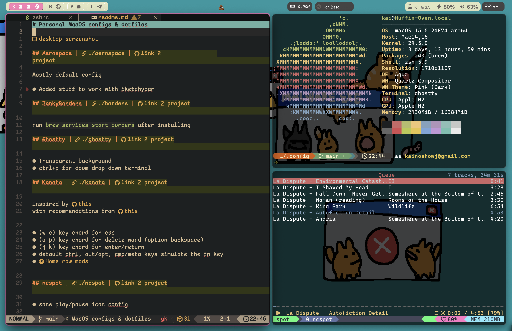

# Personal MacOS configs & dotfiles

## Kanata | [./kanata](./kanata) | [link 2 project](https://github.com/jtroo/kanata)

Inspired by [this](https://github.com/dreamsofcode-io/home-row-mods)
with recommendations from [this](https://github.com/jtroo/kanata/discussions/1455#discussion-7766783)

- (w e) key chord for esc
- [Home row mods](https://precondition.github.io/home-row-mods#what-are-home-row-mods)

## Aerospace | [./aerospace](./aerospace) | [link 2 project](https://github.com/nikitabobko/AeroSpace)

Mostly default config

- Added stuff to work with Sketchybar
- Removed `alt+shift+f` as it confilcted with auto format keybind :p

## SketchyBar | [./sketchybar](./sketchybar) | [link 2 project](https://github.com/FelixKratz/SketchyBar)

Custom taskbar

#### Dependencies

- [jq](https://jqlang.github.io/jq/)

#### Fonts

- SF [fonts](https://formulae.brew.sh/cask/font-sf-pro) & [symbols](https://formulae.brew.sh/cask/sf-symbols#default)
- [Nerd Font](https://formulae.brew.sh/cask/font-hack-nerd-font)
- [Sketchybar Font](https://github.com/kvndrsslr/sketchybar-app-font)
- [Alarm Clock](https://www.dafont.com/alarm-clock.font)

## JankyBorders | [./borders](./borders) | [link 2 project](https://github.com/FelixKratz/JankyBorders)

run `brew services start borders` after installing

## ZSH (with OMZ) | [./zsh](./zsh) | [link 2 project](https://github.com/ohmyzsh/ohmyzsh)

Add symlink to home dir `ln -s ~/.config/zsh/zshrc ~/.zshrc`

#### Dependencies

- [theme](https://github.com/egorlem/ultima.zsh-theme)

## NVIM | [./nvim](./nvim) | [link 2 project](https://github.com/folke/lazy.nvim)

just [lazy nvim](https://www.lazyvim.org/)

## Other Tools

- [zoxide](https://github.com/ajeetdsouza/zoxide)
- [yazi](https://yazi-rs.github.io/)
- [zellij](https://zellij.dev/)
- [7zip](https://formulae.brew.sh/formula/sevenzip)
- [ImageMagick](https://github.com/ImageMagick/ImageMagick)
- [ncspot](https://github.com/hrkfdn/ncspot)
- [rustfmt](https://github.com/rust-lang/rustfmt)
- [ghostty](https://github.com/ghostty-org/ghostty)
- [tmux](https://github.com/tmux/tmux/wiki)
- [eza](https://github.com/eza-community/eza)
